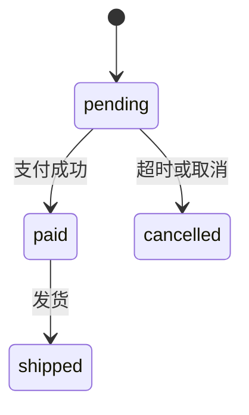

# 设计库初步优化方案

> 状态：方案草稿，待确认后再开发。路径都相对于 `harness-cursor/`。
> 前置文档：`需求分析.md`（本目录）、`docs/当前实现文档/README.md`。

## 一、结论

1. **设计库只存数据结构**：`schema.json`（tbls JSON，核心 ER）+ `ext.json`（tbls 表达不了的关系类型）。存储、渲染、对比都不变。
2. **ER 与 agent 的交换格式直接用 tbls JSON**：不引入 DBML。插件提供"复制给 AI"（带格式规范）和"从 JSON 更新"（校验、补全、差异预览、确认合并）。
3. **新增"设计图"**：状态机、时序图、流程图、数据流、用例等行为类的图，统一用 **Mermaid 文本 + 单独的布局坐标 + 表引用** 表示，放在工作区下，与设计库、数据库、画布平级。
4. **做一个 Mermaid 增强编辑器**：以 Mermaid 文本为准，额外保存坐标；图类用 Vue Flow 渲染，可拖拽摆放、图形化编辑，编辑结果写回 Mermaid 文本；agent 可以直接改 Mermaid。
5. **同步规则**：ER → 设计图自动同步；设计图 → ER 不自动，只列出差异，由用户在设计图画布中确认后再同步到 ER。

## 二、现状与问题


| 现状                                                        | 问题                                            |
| --------------------------------------------------------- | --------------------------------------------- |
| 设计库只能在画布上编辑：加到画布 → 双击空白处建表 → 属性面板改字段 → 拖字段建关系             | 新建设计库后树上没有"打开/编辑"入口，用户不知道要先加到画布               |
| 编辑能力由 `DesignOp`（`src/shared/designOps.ts`）提供：表、字段、关系的增删改 | 只能一个个点，没有批量方式，无法和 agent 协作                    |
| "从文件导入"只能新建设计库                                            | 不能用一段 JSON 更新已有设计库                            |
| 模块存在 `ext.json` 的 `modules`                               | 与 tbls 自带的 `viewpoints` 重复，`tbls doc` 看不到模块划分 |
| 只有表结构                                                     | 状态机、时序图、流程图等设计内容没有地方放                         |


## 三、数据分层

```
工作区 workspaces/<workspaceN>/
├─ design/<designN>/        设计库（数据结构，可与数据库对比）
│  ├─ source.yml
│  ├─ schema.json           tbls JSON：表、字段、约束、索引、关系、枚举（、viewpoints）
│  └─ ext.json              关系类型（逻辑 / JSON 数组 / 多态 / 字典）、模块
├─ db/<dbN>/                数据库（真实结构快照，只读）
├─ canvas/<canvasN>.canvas.json   ER 画布（布局）
└─ diagram/<diagramN>.md    新增：设计图（Mermaid + 布局 + 表引用）
```


|            | ER 结构                      | 设计图                     |
| ---------- | -------------------------- | ----------------------- |
| 内容         | 表、字段、类型、约束、关系              | 状态流转、调用顺序、业务流程、数据流向     |
| 唯一来源       | `schema.json` + `ext.json` | `diagram/<diagramN>.md` |
| 编辑器        | ER 画布（现有）                  | 设计图编辑器（新增）              |
| agent 交换格式 | tbls JSON                  | Mermaid                 |
| 参与数据库对比    | 是                          | 否                       |


各种图放在哪里：


| 图               | tbls JSON 能否表达           | 放在           |
| --------------- | ------------------------ | ------------ |
| ER 图 / 类图（属性层面） | 完全能                      | 设计库          |
| 模块 / 主题域        | 能（`viewpoints`、`labels`） | 设计库          |
| 状态机             | 只能表达状态（枚举），不能表达流转        | 设计图（绑定到状态字段） |
| 时序图、流程图、数据流、用例  | 不能                       | 设计图          |


## 四、ER 部分的优化

### 4.1 入口与空状态

- 设计库节点双击 / 行内"打开"按钮：打开包含它的画布；没有则自动新建一个画布并加入这个设计库。
- 空设计库打开后，画布中间显示引导：`新建表`、`从 JSON 创建…`、`复制给 AI…`。
- 画布工具栏增加"新建表"按钮（现在只能双击空白处）。

### 4.2 与 agent 协作：tbls JSON

**为什么不用 DBML**：存储本来就是 tbls JSON，直接用它无需转换、不丢信息、不加依赖；以后 MCP 工具参数也是 JSON Schema，格式一致。DBML 可作为以后的可选导入导出格式，不影响底层。

**交换格式**：外层包一层，与磁盘上 `schema.json` + `ext.json` 对应。只有 `schema` 是必需的。

```json
{
  "schema": {
    "tables": [
      {
        "name": "orders",
        "type": "TABLE",
        "comment": "订单",
        "columns": [
          { "name": "id", "type": "bigint", "nullable": false },
          { "name": "user_id", "type": "bigint", "nullable": false },
          { "name": "status", "type": "order_status", "nullable": false, "default": "'pending'" },
          { "name": "item_ids", "type": "jsonb", "nullable": true, "comment": "商品 ID 数组" }
        ],
        "constraints": [{ "name": "orders_pkey", "type": "PRIMARY KEY", "columns": ["id"] }]
      }
    ],
    "relations": [
      { "table": "orders", "columns": ["user_id"], "parent_table": "users", "parent_columns": ["id"] }
    ],
    "enums": [{ "name": "order_status", "values": ["pending", "paid", "shipped", "cancelled"] }]
  },
  "ext": {
    "relations": [{ "from": "orders.item_ids", "to": "items.id", "kind": "json_array" }]
  }
}
```

**格式规范（给 agent 看）** 分三块：


| 分类  | 内容                                                                                      |
| --- | --------------------------------------------------------------------------------------- |
| 必须写 | `tables[].name`、`columns[].name / type / nullable`；主键写在 `constraints`（`PRIMARY KEY`）    |
| 可选  | 表和字段的 `comment`、`default`、`UNIQUE` 约束、`indexes`、`relations` 的基数、`enums`、`ext.relations` |
| 不要写 | `driver`（以设计库的"目标数据库类型"为准）、`triggers`、`functions`、`viewpoints`、各处的 `def`                |


规范放在插件内的资源文件（例如 `media/spec/design-json.md`），"复制给 AI"时一起带上，以后作为 MCP 工具说明复用。字段定义以 tbls 官方 `spec/tbls.schema.json_schema.json` 为准（`src/shared/tbls.ts` 与之对应）。

**导入时自动补全**，减少 agent 出错：


| 缺省项                            | 补全方式                                                                                                                           |
| ------------------------------ | ------------------------------------------------------------------------------------------------------------------------------ |
| `tables[].type`                | `TABLE`                                                                                                                        |
| `constraints[].table`、`def`    | 按所在表和列生成                                                                                                                       |
| 外键约束                           | 只写了 `relations` 时，自动补上对应的 `FOREIGN KEY` 约束                                                                                     |
| `relations[].def`              | 自动生成                                                                                                                           |
| `ext.relations` 的 `from/to` 简写 | 转成内部 `RelationExt`（key 格式 `table(col,...)->parent(col,...)`），并在 `schema.relations` 中补一条 `virtual` 关系（具体映射实现时对照 `normalize.ts`） |


**功能**：

1. **复制给 AI**（设计库右键 / 画布工具栏）：把"格式规范 + 当前设计库 JSON + 一句提示词"复制到剪贴板。
  - 可选"只复制选中的表"，控制长度。
2. **从 JSON 更新…**：
  1. 粘贴文本；自动去掉 Markdown 代码块包裹。
  2. 解析 → JSON Schema 校验 → 自动补全。
  3. 与当前设计库对比，显示差异预览：新增 / 修改 / 删除的表、字段、关系、枚举；删除类默认不勾选。
  4. 可以把"删除 A + 新增 B"手动配对成"表改名"（思路同对比里的 `tableMappings`）。
  5. 确认后转成 `DesignOp` 执行，一次撤销即可回退；画布位置、`ext.json` 中未涉及的内容保持不变。
3. **校验失败**：给出能直接转交给 agent 的错误说明，例如"`relations[0].parent_table` 引用了不存在的表 `user`"，附"复制错误信息"按钮。
4. **从 JSON 创建**：新建设计库时可以直接粘贴，走同一套解析和补全，不需要差异预览。

### 4.3 快速编辑

- 属性面板支持一行一个字段的快速输入：`email varchar(128) not null unique 登录邮箱`。
- 常用字段模板：一键加 `id`、`created_at`、`updated_at`、`deleted_at`。

### 4.4 模块改存 `viewpoints`（待确认）

- 把 `ext.json` 的 `modules` 改为写入 `schema.json` 的 `viewpoints`（`name`、`desc`、`tables`，可带 `groups`）。
- 好处：`tbls doc` 直接生成按模块划分的文档；agent 只需要学 tbls 一套格式。
- 兼容：读取时仍接受 `ext.json.modules`，写入时迁移到 `viewpoints`。

### 4.5 Mermaid `erDiagram` 导出（后期）

- 只做导出（放进文档、PR 说明），单向、接受信息丢失（类型只能写一个词，没有长度、默认值、索引、关系类型）。
- 如以后要支持导入，必须走差异预览，并且不能因为 `erDiagram` 表达不了而清掉已有信息。

## 五、设计图

### 5.1 类型与语法


| 类型 `type`      | Mermaid 语法                                                  | 编辑方式              |
| -------------- | ----------------------------------------------------------- | ----------------- |
| `state` 状态机    | `stateDiagram-v2`                                           | 图（Vue Flow，可摆放坐标） |
| `flow` 流程图     | `flowchart`                                                 | 图                 |
| `dataflow` 数据流 | `flowchart` + 约定形状：`[( )]` 数据存储（可引用表）、`[[ ]]` 外部实体、`( )` 处理 | 图                 |
| `sequence` 时序图 | `sequenceDiagram`                                           | 顺序编辑（不需要坐标）       |
| `usecase` 用例   | Mermaid 没有专门语法，用 `flowchart` 模拟或 Markdown 列表                | 文本 + 预览           |


### 5.2 文件格式

`diagram/<diagramN>.md`，ID 规则与其他对象一致（`diagram1`、`diagram2`…，只增不复用）。

```markdown
---
type: state
name: 订单状态
description: 订单从创建到完成的状态流转
refs:                         # 引用的表：设计库 ID + 表名
  - design1:orders
bind: design1:orders.status   # 仅状态机：绑定的字段
layout:                       # 仅图类：节点坐标，键为 Mermaid 节点 ID
  pending:   [0, 0]
  paid:      [240, 0]
  cancelled: [0, 160]
  shipped:   [480, 0]
ignored: []                   # 用户选择"忽略"的差异，见第六节
---


```

- 文件本身可读，GitHub / Cursor 的 Markdown 预览能直接渲染，agent 可以直接修改。
- 设计图放在工作区层级，因为一张图可能引用多个设计库的表。
- 设计图不存表的内容，表名、注释、字段、枚举都在显示时从 ER 实时读取。

### 5.3 Mermaid 增强编辑器

以 Mermaid 文本为准，坐标单独保存；和 ER 画布共用 Vue Flow、elkjs、撤销重做等基础能力。

**图类（状态机、流程图、数据流）**：

1. 打开：解析 Mermaid → 节点和连线；`layout` 中有坐标的放在原处，没有的用 elkjs 自动排布。
2. 拖动节点：只更新 `layout`，正文不变。
3. 图形化编辑：新建节点、从节点拖出连线、改连线文字（事件 / 条件）、删除节点。以"设计图操作"（类似 `DesignOp`）的纯函数生成新的 Mermaid 文本。
4. 文本修改（用户手改 / agent 修改 / 粘贴）：重新解析；节点 ID 不变的保留坐标，新节点自动排布，删除的节点清掉坐标。
5. 不支持的语法：退回"文本 + mermaid.js 预览"只读模式并提示，不改动文件。
6. 左侧（或下方）始终可以切换到 Mermaid 文本视图，两边同步。

**首批支持的 Mermaid 子集**（自行解析，不依赖 mermaid.js 内部接口）：


| 类型        | 支持的写法                                                                             |
| --------- | --------------------------------------------------------------------------------- |
| 状态机       | `[*] --> A`、`A --> B : 事件`、`state "中文名" as A`、`note right of A : …`               |
| 流程图 / 数据流 | `A[文字]`、`A{判断}`、`A((圆))`、`A[(存储)]`、`A[[外部]]`、`A --> B`、`A -->                     |
| 时序图       | `participant` / `actor`、`A->>B: 消息`、`A-->>B: 返回`、`alt/else/end`、`loop/end`、`Note` |


**时序图**：布局就是参与者的左右顺序和消息的上下顺序，都已在文本里。第一版为"文本 + 预览"；之后做顺序编辑器：拖动参与者调整顺序、在生命线之间拖出消息、上下拖动调整消息顺序。

**渲染**：mermaid.js 用于预览和只读模式，按需加载成单独的包，不进画布主包；现有 CSP 已允许内联样式。

### 5.4 与 ER 画布联动

- ER 画布选中表 → 属性面板新增"设计图"页签：列出引用这张表的设计图，以及"新建状态机 / 时序图 / 流程图 / 数据流"。
- 新建时按表结构预填：
  - 状态机：选择状态字段（枚举类型的字段），用枚举值生成状态节点，写好 `refs`、`bind`；
  - 时序图：把这张表作为参与者；
  - 数据流：把这张表作为数据存储节点。
- 设计图里引用表的节点显示为"引用卡片"：可拖动摆放，内容（表名、注释、关键字段）来自 JSON，不能在设计图里改字段；点击跳到 ER 画布上的这张表。
- 设计图编辑器是单独的页签，可与 ER 画布左右并排；ER 画布上有设计图的表显示小角标。
- 树：工作区下新增"设计图"分组，节点图标按类型区分；右键"新建设计图"。

## 六、同步规则

### 6.1 ER → 设计图：自动


| ER 的变化         | 设计图中的反应                                                                       |
| -------------- | ----------------------------------------------------------------------------- |
| 表名、注释、字段、枚举值变化 | 引用节点实时显示最新内容（设计图不存这些内容）                                                       |
| 表改名            | `refs`、`bind` 自动更新（接入 `refactor.renameDesignTable`）；Mermaid 正文中出现的旧表名列为待确认替换项 |
| 表删除            | 引用节点标记为"引用的表已不存在"，不删除设计图；删表确认弹窗中列出受影响的设计图                                     |
| 枚举减少了某个值       | 状态机中使用该值的节点标黄                                                                 |


### 6.2 设计图 → ER：检测差异，用户确认后同步

检测范围（范围之外的内容，如流程说明、调用顺序，不参与检测）：


| 差异        | 例子                                    | 同步到 ER 的操作        |
| --------- | ------------------------------------- | ----------------- |
| 状态机出现新状态  | 状态机有 `refunded`，`orders.status` 的枚举没有 | 给枚举加值             |
| 状态机少了状态   | 枚举有 `archived`，状态机没有                  | 默认"忽略"；删除枚举值需单独确认 |
| 引用了不存在的表  | 数据流存储节点 `refunds`                     | 新建表（只带 `id`）      |
| 标注了字段（后期） | 节点约定写 `refunds.reason`                | 给表加字段             |


**确认界面**：设计图编辑器右侧"与 ER 的差异"页签。

```
与 ER 的差异（2）
☑ orders.status 缺少枚举值 refunded        [同步到 ER] [忽略]
☑ 设计库中没有表 refunds                   [新建表]   [忽略]
                                   [全部同步选中项]
```

- 同步：转成 `DesignOp`，走 `applyDesignOps` 写入 `schema.json`，打开的 ER 画布自动刷新。
- 忽略：记入设计图 frontmatter 的 `ignored`（如 `enum:orders.status:archived`），不再提示。
- 撤销：记在设计图编辑器的撤销栈；撤销前校验 ER 之后没有被别处改过（与现有设计编辑的撤销校验一致）。
- 执行前按最新 JSON 重新检测，避免使用过时的差异。

### 6.3 agent 的边界

- agent 可以直接修改设计图的 Mermaid 文本；对 ER 的影响一律出现在"与 ER 的差异"中，由用户确认。
- agent 修改 ER 的正式方式是 tbls JSON（第 4.2 节），同样经过差异预览。
- 以后的 MCP 工具遵循同一规则：改设计图的工具可以直接写入；改 ER 的工具必须返回差异供用户确认，或只在用户明确授权时执行。
- 数据库连接信息、数据库显示名（含主机）不进入任何交给 agent 的内容，只使用 ID。

## 七、分阶段计划

### 第一阶段：ER 可用、能和 agent 协作


| 内容                              | 主要改动                                                                |
| ------------------------------- | ------------------------------------------------------------------- |
| 设计库打开入口、空状态引导、工具栏"新建表"          | `package.json`、`commands/design.ts`、`App.vue` / `CanvasView.vue`    |
| 复制给 AI（含格式规范）                   | 新增 `media/spec/design-json.md`、`commands/design.ts`                 |
| 从 JSON 创建 / 更新：解析、校验、补全、差异预览、合并 | 新增 `src/shared/designImport.ts`（纯函数，带测试）；差异预览页面（Webview，可复用编辑页面的框架） |
| 快速输入字段、常用字段模板                   | `Inspector.vue`、`designOps.ts`                                      |
| 测试                              | `test/designImport.test.ts`：补全、差异计算、改名配对、合并不丢 `ext`                 |


### 第二阶段：设计图（文本 + 预览）


| 内容                                     | 主要改动                                                                                |
| -------------------------------------- | ----------------------------------------------------------------------------------- |
| 设计图存储、ID 分配、树分组                        | `shared/workspace.ts`（`diagram` 类型）、`workspace/storage.ts`、`views/workspaceTree.ts` |
| 文件解析：frontmatter + Mermaid 代码块         | 新增 `src/shared/diagram.ts`                                                          |
| 设计图编辑器：Mermaid 文本 + mermaid.js 预览      | 新增自定义编辑器（`*.md` 在 `diagram/` 下）及 Webview 页面                                         |
| 与 ER 联动：属性面板"设计图"页签、按表预填新建、`refs` 改名同步 | `Inspector.vue`、`workspace/refactor.ts`                                             |


### 第三阶段：增强编辑器


| 内容                                                       | 主要改动                              |
| -------------------------------------------------------- | --------------------------------- |
| 状态机 / 流程图 / 数据流用 Vue Flow 渲染，`layout` 坐标，图形化编辑写回 Mermaid | 新增 Mermaid 子集解析与生成（纯函数，带测试）、设计图操作 |
| "与 ER 的差异"：检测、同步、忽略、撤销                                   | 新增差异检测（纯函数）、设计图编辑器侧栏              |
| 时序图顺序编辑器                                                 | 单独组件                              |


### 以后再考虑

- `viewpoints`模块改存 `viewpoints`（第 4.4 节，可提前到第一阶段，视确认结果）。
- Mermaid `erDiagram` 导出；DBML 导入导出。
- MCP 工具（读 ER、改设计图、提交 ER 修改建议）。

## 八、待确认

1. ER 与 agent 的交换格式定为 tbls JSON（外层 `{ schema, ext }`），暂不做 DBML —— 是否同意？
2. 模块是否改存 tbls 的 `viewpoints`？
3. 设计图放在工作区层级（`diagram/`），而不是某个设计库下面 —— 是否同意？
4. 用例图是否需要单独支持，还是先用流程图 / Markdown 列表代替？
5. 第一阶段"从 JSON 更新"的差异预览，是做成单独的 Webview 页面，还是放进 ER 画布右侧的面板？

