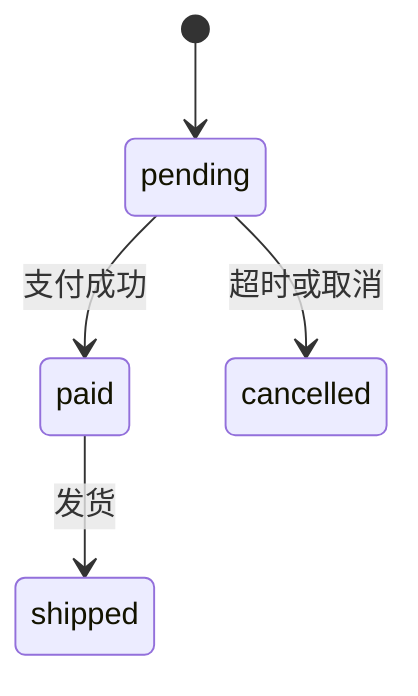
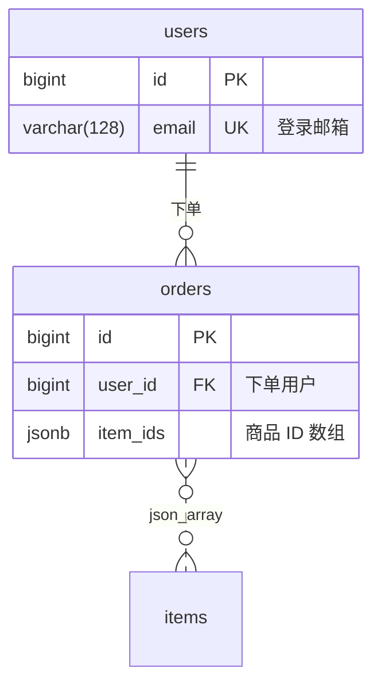

# 设计库初步优化方案

> 状态：方案草稿，待确认后再开发。路径都相对于 `harness-cursor/`。
> 前置文档：`需求分析.md`（本目录）、`docs/当前实现文档/README.md`。

## 一、结论

1. **表结构只存 tbls JSON**：设计库的 `schema.json`（tbls JSON）+ `ext.json`（tbls 表达不了的关系类型）是唯一来源。存储、渲染、与数据库对比都不变。
2. **文本格式只用 Mermaid**：不引入 DBML。ER 图用 `erDiagram`，其他设计图用 `stateDiagram-v2`、`sequenceDiagram`、`flowchart`。
3. **agent 只写 Mermaid**：agent 可以读表结构（JSON 或 Mermaid），但只修改设计图文件。**表结构只由用户修改**：在 ER 画布上直接编辑，或在右侧面板审核 Mermaid 的差异后同步。
4. **设计图放在设计库下**：`design/<designN>/diagrams/`。类型：ER 图、状态图、时序图、流程图、数据流图。ER 图是表结构的草稿，也是和 agent 协作修改表结构的入口。
5. **Mermaid 增强编辑器**：以 Mermaid 文本为准，坐标单独保存；图类可拖拽摆放、图形化编辑，结果写回 Mermaid 文本。
6. **同步规则**：表结构 → 设计图自动；设计图 → 表结构不自动，差异显示在右侧面板，由用户确认后同步。
7. **模块改存 tbls 的 `viewpoints`**，不再用 `ext.json` 的 `modules`。

暂不做：DBML、用例图、从 JSON 文本更新表结构。

## 二、现状与问题

| 现状 | 问题 |
| :-- | :-- |
| 设计库只能在画布上编辑：加到画布 → 双击空白处建表 → 属性面板改字段 → 拖字段建关系 | 新建设计库后树上没有"打开/编辑"入口，用户不知道要先加到画布 |
| 编辑能力由 `DesignOp`（`src/shared/designOps.ts`）提供：表、字段、关系的增删改 | 只能一个个点，无法和 agent 协作 |
| 模块存在 `ext.json` 的 `modules` | 与 tbls 自带的 `viewpoints` 重复，`tbls doc` 看不到模块划分 |
| 只有表结构 | 状态机、时序图、流程图等设计内容没有地方放 |

## 三、命名与结构

### 3.1 树

```
工作区 1
├─ 设计库
│  └─ 订单设计库                 设计库（可改名，默认"设计库 N"）
│     ├─ 表结构 · 25 张表         schema.json + ext.json，展开是表 → 字段
│     └─ 设计图 · 4               diagrams/
│        ├─ ER 图 · 订单域
│        ├─ 状态图 · orders.status
│        ├─ 时序图 · 下单支付
│        └─ 流程图 · 退款审核
├─ 数据库
│  └─ 10.0.0.8:5432/shop
└─ 画布                          可同时放多个设计库、数据库的表
   └─ 画布 1
```

| 概念 | 名称 | 说明 |
| :-- | :-- | :-- |
| 容器 | 设计库 | 不变 |
| 表和关系 | **表结构** | `schema.json` + `ext.json`。不叫"ER 图"，避免和画布、ER 设计图混淆 |
| 设计图统称 | **设计图** | 分组名 |
| 设计图类型 | **ER 图 / 状态图 / 时序图 / 流程图 / 数据流图** | `type`：`er` / `state` / `sequence` / `flow` / `dataflow` |
| 设计图默认名 | 状态图："`<表>.<字段>` 状态图"；其他："ER 图 1"、"时序图 1"… | 可改名（F2、编辑面板） |
| 画布 | 画布 | 不变 |

### 3.2 存储

```
workspaces/<workspaceN>/
├─ design/<designN>/
│  ├─ source.yml
│  ├─ schema.json            tbls JSON：表、字段、约束、索引、关系、枚举、viewpoints（模块）
│  ├─ ext.json               关系类型（逻辑 / JSON 数组 / 多态 / 字典）
│  └─ diagrams/
│     ├─ diagram1.md          type: er
│     ├─ diagram2.md          type: state
│     └─ diagram3.md          type: sequence
├─ db/<dbN>/
└─ canvas/<canvasN>.canvas.json
```

- 设计图 ID 在设计库内分配：`diagram1`、`diagram2`…，只增不复用，计数器存在 `source.yml` 的 `seq.diagram`。
- 设计图只能引用**本设计库**的表，所以 `refs` 直接写表名。
- 删除设计库时一并删除它的设计图。

### 3.3 职责

| | 表结构 | 设计图 |
| :-- | :-- | :-- |
| 内容 | 表、字段、类型、约束、关系、枚举、模块 | ER 草稿、状态流转、调用顺序、业务流程、数据流向 |
| 唯一来源 | `schema.json` + `ext.json` | `diagrams/<diagramN>.md` |
| 谁能改 | 只有用户（ER 画布编辑、右侧面板同步） | 用户和 agent |
| 编辑器 | ER 画布（现有） | 设计图编辑器（新增） |
| 参与数据库对比 | 是 | 否 |

## 四、表结构的优化

### 4.1 入口与空状态

- 树上"表结构"节点双击 / 行内"打开"按钮：打开包含这个设计库的画布；没有则自动新建画布并加入。
- 空设计库打开后，画布中间显示引导：`新建表`、`新建 ER 图（和 AI 一起设计）`。
- 画布工具栏增加"新建表"按钮（现在只能双击空白处）。

### 4.2 快速编辑

- 属性面板支持一行一个字段的快速输入：`email varchar(128) not null unique 登录邮箱`。
- 常用字段模板：一键加 `id`、`created_at`、`updated_at`、`deleted_at`。

### 4.3 模块改存 `viewpoints`

`viewpoints` 是 tbls 自带的"视点"，把大库按主题拆成多张小 ER 图，`tbls doc` 会给每个视点单独生成一页。字段（`src/shared/tbls.ts` 的 `TblsViewpoint`）：

| 字段 | 含义 |
| :-- | :-- |
| `name`、`desc` | 模块名、说明 |
| `tables` | 包含的表 |
| `labels` | 按标签选表 |
| `distance` | 顺着关系再带进 N 层的表 |
| `groups` | 模块内再分组（可带颜色） |

- 模块的读写改到 `schema.json` 的 `viewpoints`；`DesignExt.modules` 只在读取时兼容，保存时迁移。
- 改表名、删表时同步更新 `viewpoints[].tables` 和 `groups[].tables`（现在对 `ext.modules` 的处理在 `designOps.ts` 第 330、343 行附近）。
- 需要验证：`tbls doc json://schema.json` 是否使用 JSON 中的 `viewpoints`。不使用时，生成文档前从 JSON 取出写入临时 `.tbls.yml`。

## 五、设计图

### 5.1 类型

| 类型 | Mermaid 语法 | 编辑方式 | 与表结构同步 |
| :-- | :-- | :-- | :-- |
| `er` ER 图 | `erDiagram` | 图 | 表、字段、关系（第 6.2 节） |
| `state` 状态图 | `stateDiagram-v2` | 图 | 状态 ↔ 绑定字段的枚举值 |
| `flow` 流程图 | `flowchart` | 图 | 不同步 |
| `dataflow` 数据流图 | `flowchart` + 约定形状：`[( )]` 数据存储（引用表）、`[[ ]]` 外部实体、`( )` 处理 | 图 | 引用了不存在的表 |
| `sequence` 时序图 | `sequenceDiagram` | 顺序编辑（不需要坐标） | 引用了不存在的表 |

### 5.2 文件格式

````markdown
---
type: state
name: orders.status 状态图
description: 订单从创建到完成的状态流转
refs: [orders]            # 引用的表（本设计库）；ER 图的 refs 即同步范围，见 6.2
bind: orders.status       # 仅状态图：绑定的字段
layout:                   # 仅图类：节点坐标，键为 Mermaid 节点 ID
  pending:   [0, 0]
  paid:      [240, 0]
  cancelled: [0, 160]
  shipped:   [480, 0]
ignored: []               # 用户选择"忽略"的差异，见 6.3
---


````

- 文件本身可读，GitHub / Cursor 的 Markdown 预览能直接渲染，agent 可以直接修改。
- 设计图不存表的内容；引用节点显示的表名、注释、字段、枚举都从表结构实时读取。

### 5.3 ER 图（`type: er`）

ER 图是表结构的 Mermaid 草稿，也是 agent 修改表结构的唯一途径。



**与 tbls JSON 的对应**：

| `erDiagram` | tbls JSON / ext.json |
| :-- | :-- |
| `users { ... }` | `tables[]`（新表的 `type` 为 `TABLE`） |
| `bigint id` | `columns[].type / name`（类型可带括号，如 `varchar(128)`，实现时按 Mermaid 官方语法验证） |
| `PK` / `UK` / `FK` | `PRIMARY KEY` / `UNIQUE` 约束；`FK` 用于推断关系对应的字段 |
| 行尾 `"..."` | `columns[].comment` |
| `\|\|--o{` 等基数符号 | `relations[].cardinality / parent_cardinality` |
| `--` 实线 | 普通关系（`fk`） |
| `..` 虚线 | 逻辑关系（`virtual`，无真实外键） |
| 关系标签 `json_array` / `polymorphic` / `dictionary` | `ext.json` 的关系类型；其他标签作为关系说明 |

**`erDiagram` 表达不了的信息**：

| 信息 | 处理 |
| :-- | :-- |
| 可空 / 非空 | 新字段默认：主键非空，其他可空；在同步面板或属性面板中调整 |
| 默认值、自增、索引、枚举值、表注释 | 只在表结构中维护（属性面板） |
| 关系对应的字段 | `erDiagram` 的关系只到表。同步时推断：子表中标 `FK` 且名为 `<父表单数>_id` / `<父表>_id` 的字段，对应父表主键；推断不出时在同步面板中让用户选择 |

**合并原则：Mermaid 表达不了的信息，同步时一律保留表结构中原有的值，不清空。**

**生成 ER 图**：设计图分组右键"从表结构生成 ER 图"（可选全部表或按模块 / 选中的表），把当前 JSON 转成 `erDiagram`，`refs` 记为所选表。和 agent 协作时从这里开始。

### 5.4 Mermaid 增强编辑器

以 Mermaid 文本为准，坐标单独保存；与 ER 画布共用 Vue Flow、elkjs、撤销重做等基础能力。

**图类（ER 图、状态图、流程图、数据流图）**：

1. 打开：解析 Mermaid → 节点和连线；`layout` 中有坐标的放在原处，没有的用 elkjs 自动排布。
2. 拖动节点：只更新 `layout`，正文不变。
3. 图形化编辑：新建节点、从节点拖出连线、改连线文字、删除节点；ER 图还可以增删改字段。编辑以"设计图操作"（类似 `DesignOp`）的纯函数生成新的 Mermaid 文本。
4. 文本修改（用户手改 / agent 修改）：重新解析；节点 ID 不变的保留坐标，新节点自动排布，删除的节点清掉坐标。
5. 不支持的语法：退回"文本 + mermaid.js 预览"只读模式并提示，不改动文件。
6. 可以随时切换到 Mermaid 文本视图，两边同步。
7. ER 图的表节点复用 ER 画布的 `TableNode` 样式，并标出与表结构的差异（新增 / 修改 / 未出现）。

**首批支持的 Mermaid 子集**（自行解析，不依赖 mermaid.js 内部接口）：

| 类型 | 支持的写法 |
| :-- | :-- |
| ER 图 | 实体块 `名 { 类型 字段 键 "注释" }`、关系 `A \|\|--o{ B : "标签"`（`--` / `..`，四种基数） |
| 状态图 | `[*] --> A`、`A --> B : 事件`、`state "中文名" as A`、`note right of A : …` |
| 流程图 / 数据流图 | `A[文字]`、`A{判断}`、`A((圆))`、`A[(存储)]`、`A[[外部]]`、`A --> B`、`A -->|条件| B`、`subgraph … end` |
| 时序图 | `participant` / `actor`、`A->>B: 消息`、`A-->>B: 返回`、`alt/else/end`、`loop/end`、`Note` |

**时序图**：布局就是参与者的左右顺序和消息的上下顺序，都在文本里。第一版为"文本 + 预览"；之后做顺序编辑器：拖动参与者调整顺序、在生命线之间拖出消息、上下拖动调整消息顺序。

**渲染**：mermaid.js 只用于预览和只读模式，按需加载成单独的包；现有 CSP 已允许内联样式。

### 5.5 与 ER 画布联动

- ER 画布选中表 → 属性面板新增"设计图"页签：列出引用这张表的设计图，以及"新建状态图 / 时序图 / 流程图 / 数据流图 / ER 图"。
- 新建时按表结构预填：
  - 状态图：选择状态字段，用枚举值生成状态节点，写好 `refs`、`bind`；
  - 时序图：把这张表作为参与者；
  - 数据流图：把这张表作为数据存储节点；
  - ER 图：生成这张表及其直接关联的表。
- 设计图中引用表的节点显示为"引用卡片"：可拖动摆放，内容来自表结构；点击跳到 ER 画布上的这张表。
- 设计图编辑器是单独的页签，可与 ER 画布左右并排；ER 画布上有设计图的表显示小角标。

## 六、同步规则

### 6.1 表结构 → 设计图：自动

| 表结构的变化 | 设计图中的反应 |
| :-- | :-- |
| 表名、注释、字段、枚举值变化 | 引用节点实时显示最新内容 |
| 表改名 | `refs`、`bind`、`layout` 的键自动更新（接入 `refactor.renameDesignTable`）；Mermaid 正文中的旧表名列为待确认替换项 |
| 表删除 | 引用节点标记为"表已不存在"，不删除设计图；删表确认弹窗中列出受影响的设计图 |
| 枚举减少了某个值 | 状态图中使用该值的节点标黄 |
| ER 图与表结构不一致 | ER 图编辑器中标出差异；右侧面板提供"用表结构重新生成"（覆盖前确认） |

### 6.2 设计图 → 表结构：检测差异

**ER 图的检测范围**：只比较 `refs` 中的表，以及 Mermaid 中新出现的表。`refs` 以外、Mermaid 中也没有的表不受影响，所以 agent 只写部分表不会误删其他表。

| 差异 | 同步到表结构的操作 | 默认 |
| :-- | :-- | :-- |
| 新表 | `table.add` + 字段 | 勾选 |
| `refs` 中的表在 Mermaid 中没有了 | `table.delete` | **不勾选** |
| 新字段 | `column.add`（可空按 5.3 规则） | 勾选 |
| 字段类型、注释变化 | `column.update` | 勾选 |
| 字段在 Mermaid 中没有了 | `column.delete` | **不勾选**（agent 常为简洁省略字段） |
| `PK` / `UK` 变化 | 更新约束 | 勾选 |
| 新关系 / 关系类型变化 | `relation.add` / `relation.update`；字段推断不出时要求选择 | 勾选 |
| 关系没有了 | `relation.delete` | **不勾选** |
| "删除表 A + 新增表 B" | 可手动配对为 `table.rename` | — |

**其他设计图的检测范围**：

| 差异 | 同步到表结构的操作 | 默认 |
| :-- | :-- | :-- |
| 状态图出现新状态 | 给绑定字段的枚举加值 | 勾选 |
| 状态图少了枚举中的值 | 删除枚举值 | **不勾选** |
| 数据流图 / 时序图引用了不存在的表 | 新建表（只带 `id`） | 勾选 |

流程说明、调用顺序等内容不参与检测。

### 6.3 右侧面板

两处都放在右侧面板，共用同一个差异列表组件：

| 位置 | 页签 | 内容 |
| :-- | :-- | :-- |
| 设计图编辑器 | 与表结构的差异 | 当前设计图的差异 |
| ER 画布 | 待同步 | 汇总画布上各设计库**所有设计图**的差异，按设计图分组，可以在 ER 画布上一次处理 |

```
待同步（3）
ER 图 · 订单域
  ☑ 新表 refunds（4 个字段）                    [查看]
  ☑ orders.refund_id bigint                     
  ☐ 删除字段 orders.remark（ER 图中未出现）      
  ⚠ 关系 orders → refunds：请选择字段 [refund_id ▾]
状态图 · orders.status
  ☑ 枚举 order_status 增加 refunded
                         [忽略选中项]  [同步选中项到表结构]
```

- **同步**：转成 `DesignOp`，走 `applyDesignOps` 写入 `schema.json`，打开的 ER 画布和设计图自动刷新。
- **忽略**：记入该设计图 frontmatter 的 `ignored`（如 `column:orders.remark`、`enum:order_status:archived`），不再提示。
- **撤销**：同步记在发起面板所在编辑器的撤销栈；撤销前校验表结构之后没有被别处改过（与现有设计编辑的撤销校验一致）。
- **执行前重新检测**：点"同步"时按最新 JSON 重新计算，避免使用过时的差异。

### 6.4 agent 的边界

- agent 只修改设计图文件（Mermaid 正文；可以改 `refs`，不改 `layout`、`ignored`）。
- agent 可以读取表结构：给 agent 的上下文可以是 tbls JSON（信息完整）或生成的 `erDiagram`。
- 表结构的任何修改都经过右侧面板由用户确认。
- 以后的 MCP 工具遵循同一规则：提供"读表结构""读 / 写设计图"，不提供直接写表结构的工具。
- 数据库连接信息、数据库显示名（含主机）不进入任何交给 agent 的内容，只使用 ID。

### 6.5 复制给 AI

设计库 / 设计图右键"复制给 AI"：复制"格式说明 + 当前内容 + 一句提示词"到剪贴板。

- 格式说明放在插件资源文件（如 `media/spec/mermaid-design.md`）：各类设计图支持的 Mermaid 子集、ER 图的键和关系标签约定、"只输出 Mermaid 代码块"等要求；以后作为 MCP 工具说明复用。
- 当前内容：设计图的 Mermaid；表结构可选附 tbls JSON 或生成的 `erDiagram`（可只含选中的表）。
- agent 返回后，用户把 Mermaid 粘贴进设计图（文本视图或"粘贴替换正文"），差异出现在右侧面板。

## 七、分阶段计划

### 第一阶段：表结构 + ER 图协作

| 内容 | 主要改动 |
| :-- | :-- |
| 树结构"表结构 / 设计图"、打开入口、空状态引导、工具栏"新建表" | `views/workspaceTree.ts`、`package.json`、`commands/design.ts`、`App.vue` / `CanvasView.vue` |
| 模块改存 `viewpoints`（含兼容和改名同步） | `shared/designOps.ts`、`model/normalize.ts`、`shared/model.ts` |
| 设计图存储、ID 分配、frontmatter 解析 | `shared/workspace.ts`、`workspace/storage.ts`、新增 `src/shared/diagram.ts` |
| `erDiagram` 解析与生成（JSON ↔ Mermaid） | 新增 `src/shared/mermaid/er.ts`（纯函数） |
| ER 图差异检测与合并（保留 Mermaid 表达不了的信息、字段推断） | 新增 `src/shared/diagramSync.ts`（纯函数） |
| 设计图编辑器：Mermaid 文本 + mermaid.js 预览 | 新增自定义编辑器与 Webview 页面 |
| 右侧面板"与表结构的差异" / "待同步" | 新增差异列表组件，接入设计图编辑器和 ER 画布 |
| 复制给 AI、格式说明 | 新增 `media/spec/mermaid-design.md`、命令 |
| 快速输入字段、常用字段模板 | `Inspector.vue`、`designOps.ts` |
| 测试 | `test/mermaidEr.test.ts`（解析 / 生成 / 往返）、`test/diagramSync.test.ts`（范围、默认勾选、保留信息、字段推断、改名配对） |

### 第二阶段：其他设计图

| 内容 | 主要改动 |
| :-- | :-- |
| 状态图、时序图、流程图、数据流图：文本 + 预览 | `shared/diagram.ts`、设计图编辑器 |
| 状态图与枚举的差异、引用不存在的表 | `shared/diagramSync.ts` |
| 与 ER 画布联动：属性面板"设计图"页签、按表预填新建、改名同步 `refs` / `bind` | `Inspector.vue`、`workspace/refactor.ts` |

### 第三阶段：增强编辑器

| 内容 | 主要改动 |
| :-- | :-- |
| ER 图、状态图、流程图、数据流图用 Vue Flow 渲染，`layout` 坐标，图形化编辑写回 Mermaid | 新增各类 Mermaid 子集解析与生成（纯函数，带测试）、设计图操作 |
| 时序图顺序编辑器 | 单独组件 |

### 以后再考虑

- MCP 工具（读表结构、读写设计图）。
- `tbls doc` 生成文档时带上设计图（Markdown 附在文档目录中）。

## 八、待确认

1. ER 图的同步范围按 `refs` 计算（第 6.2 节），agent 只写部分表时不会误删其他表 —— 是否同意？
2. 新字段的可空默认值：主键非空、其他可空 —— 是否同意？还是一律非空？
3. 关系标签 `json_array` / `polymorphic` / `dictionary` 作为关系类型约定 —— 是否同意？
4. 第一阶段的设计图编辑器先只做"文本 + 预览"，图形化编辑放到第三阶段 —— 是否同意？
